# NutriFit Healthy

## Repository

[GitHub Repository](https://github.com/isadoraspirov/nutri_fit)

## Live Website

[NutriFit Healthy - Heroku](https://nutri-fit-0441994a2e9a.herokuapp.com/)

## Table of Contents

- [Introduction](#introduction)
- [Business Goals](#business-goals)
- [User Goals](#user-goals)
- [Strategy](#strategy)
- [Scope](#scope)
- [Structure](#structure)
- [Information Architecture](#information-architecture)
- [User Stories](#user-stories)
- [Features](#features)
- [Technologies Used](#technologies-used)
- [Database Design](#database-design)
- [Project Management](#project-management)
- [Security](#security)
- [Testing](#testing)
- [Known Issues](#known-issues)
- [Future Features](#future-features)
- [Deployment](#deployment)
- [Local Development](#local-development)
- [Environment Variables](#environment-variables)
- [Credits](#credits)
- [Artificial Intelligence Usage](#artificial-intelligence-usage)
- [License](#license)

## Introduction

NutriFit Healthy is a full-stack Django e-commerce website designed to help users achieve their fitness goal through offering nutrition and workout plans. The application combines health and fitness content with account management, shopping cart functionality, Stripe Checkout, order creation, and order history.

The project was developed to demonstrate full-stack web development skills using Python, Django, HTML, CSS, JavaScript, Bootstrap, relational database models, authentication, form validation, session-based cart management, and third-party payment integration.

Costumers can browse nutrition and workout plans, add products to their shopping cart, edit their order updating quantities, removing products, proceed through checkout, and complete a test payment using Stripe. Registered users can also create and manage their personal profile and view orders associated with their account.

The application demonstrates CRUD functionality through customer profile management:

- **Create** — users can create and save their personal details.
- **Read** — users can view their saved profile and order history.
- **Update** — users can edit their saved personal details.
- **Delete** — users can delete their saved personal details.

### Project Focus

- Create a responsive health and fitness e-commerce website.
- Allow users to browse nutrition and workout plans.
- Implement account registration, login, logout, and profile management.
- Implement full CRUD functionality for customer profile details.
- Create a session-based shopping cart.
- Allow users to update quantities and remove products from the cart.
- Integrate Stripe Checkout for test payments.
- Create and store customer orders.
- Allow registered users to view their order history.
- Use JavaScript to improve user interaction while purchasing to prevent users delete items accidentally.
- Apply form validation and security features.
- Deploy the completed Django application to Heroku.

## Business Goals

- Present NutriFit Healthy as a clear and professional health and fitness service.
- Promote nutrition and workout plans.
- Provide customers with a simple purchasing process.
- Allow customers to manage their account information.
- Provide secure payment processing through Stripe.
- Maintain a record of completed customer orders.
- Create a responsive and accessible experience across different devices.

## User Goals

- Understand what NutriFit Healthy offers.
- Browse available nutrition plans.
- Browse available workout plans.
- View plan descriptions and prices.
- Add plans to a shopping cart.
- Change quantities or remove unwanted products.
- Complete a secure checkout.
- Register and log in to an account.
- Save and manage personal details.
- View previous orders.
- Use the website easily on desktop, tablet, and mobile devices.

## Strategy

The strategy for NutriFit Healthy focuses on providing a straightforward journey from discovering a fitness or nutrition plan to completing a purchase.

The visual design uses a dark green, gold, and sage colour palette to create a healthy, natural, and professional identity. Navigation is kept consistent across the application, while Bootstrap and custom CSS provide responsive layouts.

Django handles authentication, customer profiles, products, orders, form processing, and server-side functionality. Session storage is used for the shopping cart, while Stripe Checkout provides the payment flow.

## Scope

### Must Have

- Responsive homepage.
- Nutrition plan catalogue.
- Workout plan catalogue.
- User registration.
- User login and logout.
- Customer profile creation.
- Profile viewing, editing, and deletion.
- Shopping cart.
- Cart quantity updates.
- Remove-from-cart functionality.
- Checkout form.
- Stripe test payment integration.
- Order creation.
- Order totals.
- Successful payment confirmation.
- Registered-user order history.
- Django messages and form validation.
- Responsive navigation and footer.

### Nice to Have / Future Improvements

- Downloadable plan content after purchase.
- Email order confirmation.
- Stripe webhook processing for stronger production payment verification.
- Password reset functionality with email delivery.
- Product search and filtering.
- Customer progress tracking.
- Reviews and ratings.
- Subscription-based plans.
- Social authentication.

## Structure

The website guides users from discovering NutriFit Healthy to selecting and purchasing a plan.

### Homepage

- NutriFit Healthy branding.
- Hero section.
- Introduction to the service.
- Calls to action.
- Links to nutrition and workout plans.

### Nutrition Plans

- Available nutrition plans.
- Plan name.
- Description.
- Price.
- Add/select plan functionality.

### Workout Plans

- Available workout plans.
- Plan name.
- Description.
- Price.
- Add/select plan functionality.

### Shopping Cart

- Selected plans.
- Product type.
- Price.
- Quantity.
- Subtotal.
- Order total.
- Update quantity controls.
- Remove buttons.
- Continue to Checkout button.

### Checkout

- Customer information form.
- Form validation.
- Back to Cart option.
- Continue to Payment button.
- Stripe Checkout redirection.

### Checkout Success

- Successful payment message.
- Order information.
- Confirmation that the purchase was completed.

### My Account

- Saved customer details.
- Create details.
- Edit details.
- Delete details.
- Previous order history.

### Authentication

- Sign Up.
- Login.
- Logout.
- Authentication validation and feedback.

### Footer

- NutriFit Healthy description.
- Navigation links.
- Contact email.
- Instagram information.
- Copyright information.

## Information Architecture

### Main Navigation

The main navigation provides access to:

**Home | Nutrition Plans | Workouts | My Account | Shopping Cart**

When the user is logged out, the My Account menu provides:

**Login | Sign Up**

When the user is authenticated, it provides in dropdown menu:

**My Details | My Orders | Logout**

## Page Hierarchy

### Homepage

- Navigation
- Hero Section
- Main Content
- Calls to Action
- Footer

### Nutrition

- Nutrition Plan Cards
- Plan Information
- Add to Cart

### Workouts

- Workout Plan Cards
- Plan Information
- Add to Cart

### Cart

- Selected Products
- Quantity Controls
- Remove Controls
- Total
- Checkout CTA

### Checkout

- Customer Details Form
- Validation
- Stripe Checkout

### Account

- Personal Details
- Edit/Delete Controls
- Order History

## User Stories

The project was managed using GitHub Projects. The original project concept evolved during development, so some early user stories were revised to reflect the functionality delivered in the final application.

### User Story 1 — Register an Account

**Story:**

As a new user I want to create an account so that I can I can log in, manage my personal details, and access my order history.

**Acceptance Criteria:**

- A user can access the sign-up page.
- A user can register using valid account details.
- Invalid or incomplete information displays validation errors.
- A registered user can subsequently log in.

### User Story 2 — Log In and Log Out

**Story:**

As a registered user I want to log in and log out securely so that I can access my saved information.

**Acceptance Criteria:**

- Registered users can log in using valid credentials.
- Invalid credentials display an appropriate error.
- Logged-in users can access account-specific functionality.
- Users can log out successfully.
- Navigation changes according to authentication status.

### User Story 3 — Manage My Profile

**Story:**

As a logged-in user I want to create, view, update, and delete my personal details so that I can manage the information associated with my account.

**Acceptance Criteria:**

- A logged-in user can add personal details.
- Saved profile information is displayed on the My Account page.
- A user can edit their saved information.
- A user can delete their saved personal details.
- The user receives feedback after successful actions.
- Deleting personal details does not delete previous order history.

### User Story 4 — Browse Nutrition Plans

**Story:**

As a customer I want to browse available nutrition plans so that I can choose a plan that supports my health and nutrition goals.

**Acceptance Criteria:**

- Available nutrition plans are displayed clearly.
- Each plan provides relevant information such as name, description and price.
- Users can select a nutrition plan.
-  Users can add a selected plan to their shopping cart.

### User Story 5 — Browse Workout Plans

**Story:**

As a costumer I want browse available workout plans so that I can select a training programme suitable for my goals.

**Acceptance Criteria:**

- Workout plans are displayed clearly.
- Each plan includes relevant information such as name, description and price.
- Users can choose a workout plan.
- Users can add a workout plan to their shopping cart.

### User Story 6 — Manage Shopping Cart

**Story:**

As a costumer I want to manage the products in my shopping cart so that I can review and change my selections before purchasing.

**Acceptance Criteria:**

- Users can add nutrition and workout plans to the cart.
- The cart displays the selected plans.
- The cart displays prices, quantities, subtotals and the overall total.
- Users can update item quantities.
- Users can remove items.
- JavaScript asks for confirmation before an item is removed.
- The cart icon displays the number of products currently in the cart.

### User Story 7 — Complete Checkout

**Story:**

As a costumer I want to enter my details and proceed securely to checkout so that I can purchase my selected nutrition or workout plans.

**Acceptance Criteria:**

- Customers can proceed from the cart to checkout.
- The checkout form collects the required customer information.
- Details are automatically populated where appropriate for logged-in users.
- Invalid information is rejected with validation feedback.
- The customer can proceed to Stripe Checkout.

### User Story 8 — Make a Secure Payment

**Story:**

As a costumer I want to pay securely for my selected plans so that I can complete my purchase safely.

**Acceptance Criteria:**

- Stripe Checkout is used to process payment.
- The order amount matches the shopping cart total.
- Stripe test-mode payments can be completed successfully.
- A successful payment redirects the customer to a confirmation page.
- The cart is cleared after successful payment.
- Unsuccessful or cancelled payments do not display a successful purchase confirmation.

### User Story 9 — View My Order History

**Story:**

As a registered user I want to view my previous orders so that I can keep track of the plans I have purchased.

**Acceptance Criteria:**

- Logged-in users can access My Orders from their account.
- Previous orders associated with the user are displayed.
- Each order shows its order number.
- The purchase date is displayed.
- Purchased items and quantities are displayed.
- The order total is displayed.
- A user cannot see another user's order history.

### User Story 10 — Responsive and Accessible Navigation

**Story:**

As a user I want to navigate NutriFit easily on different devices so that I can access the website regardless of the device I am using.

**Acceptance Criteria:**

- The navigation provides access to Home, Nutrition Plans and Workouts.
- Users can access the shopping cart from the navbar.
- Logged-out users can access Login and Sign Up.
- Logged-in users can access My Details, My Orders and Logout.
- The navigation collapses appropriately on smaller screens.

## Features

### Navigation Bar


- Responsive Bootstrap navigation.
- NutriFit Healthy logo links to the homepage.
- Links to Home, Nutrition Plans, and Workouts.
- Account dropdown changes depending on authentication state.
- Shopping cart icon displays the current cart count.
- Collapsible mobile navigation.

### Hero Section


- Full-width branded hero section.
- Optimised WebP background image.
- NutriFit Healthy branding and introductory content.
- Clear calls to action.
- Responsive layout.

### Nutrition Plans

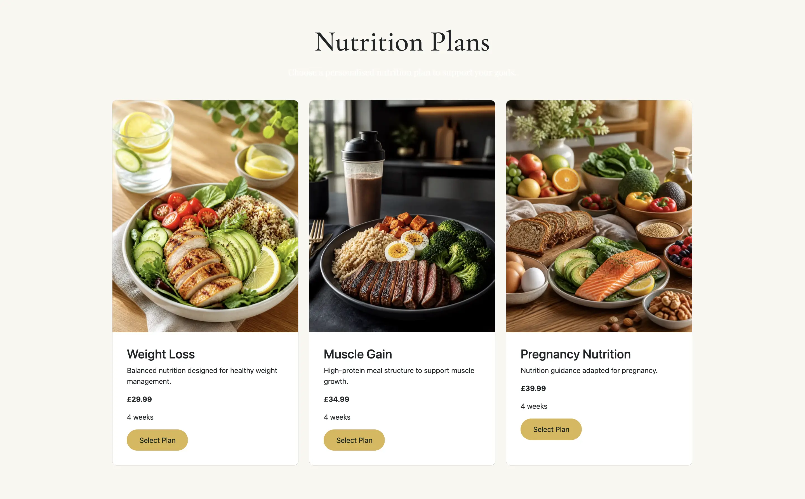

- Displays available nutrition products.
- Each plan includes its name, description, and price.
- Customers can select plans and add them to the cart.

### Workout Plans


- Displays available workout products.
- Each plan includes its name, description, and price.
- Customers can add workout plans to the cart.

### Shopping Cart

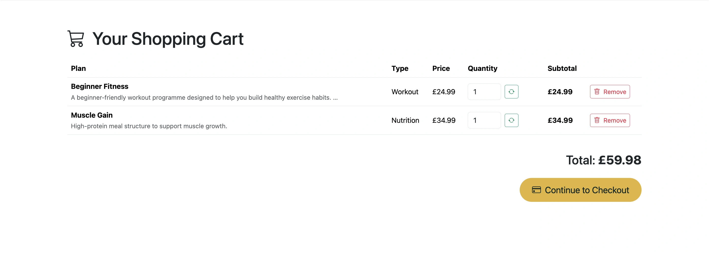

- Displays nutrition and workout plans together.
- Shows type, price, quantity, subtotal, and total.
- Quantity can be changed.
- Products can be removed.
- JavaScript confirmation reduces accidental deletion.
- Customers can continue directly to checkout.

### Checkout

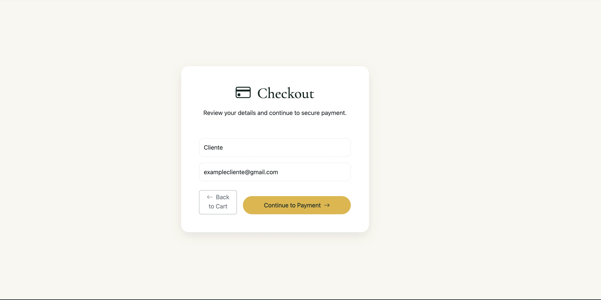

- Django form collects customer information.
- Server-side validation displays field errors.
- Customers can return to their cart before payment.
- Valid orders continue to Stripe Checkout.

### Stripe Payment

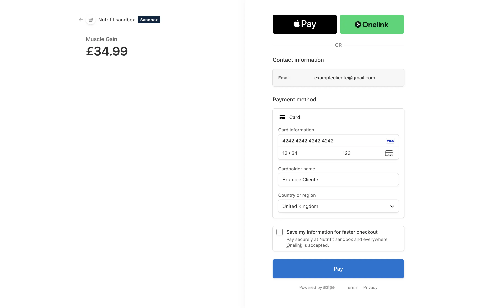

- Stripe Checkout provides the payment interface.
- Payments are completed using Stripe test mode for this educational project.
- Order information is associated with the Stripe Checkout Session.

### Checkout Success

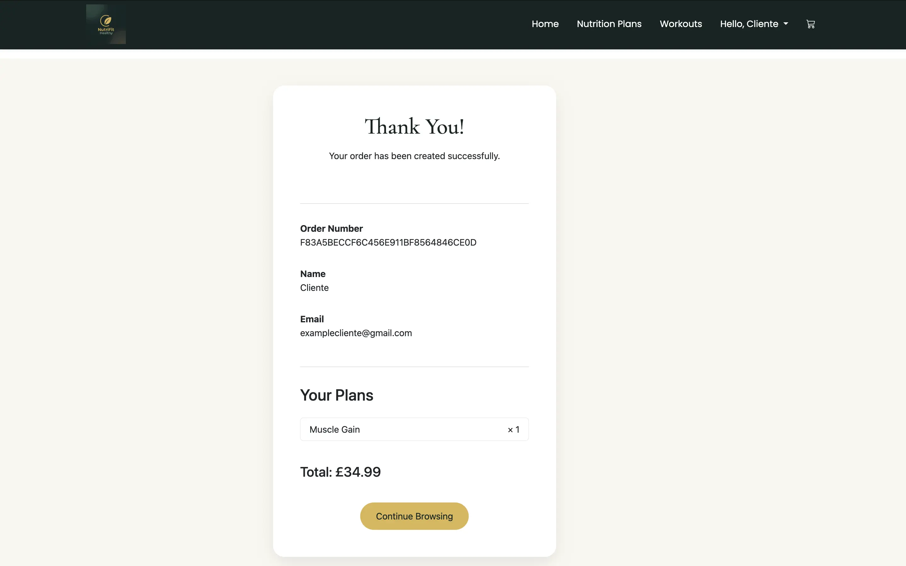

- Stripe Checkout Session is verified after redirect.
- Successful payment displays a confirmation page.
- Shopping cart is cleared after confirmed payment.

### User Account & Order History

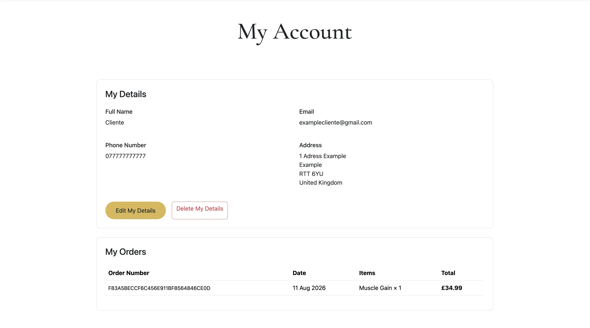

- Displays saved personal information.
- Allows users to create, edit, and delete profile details.
- Provides access to order history.
- Displays orders associated with the logged-in user.
- Shows order number, date, purchased products, quantities, and total.

### Django Messages

- Success, warning, error, and information messages provide feedback.
- JavaScript automatically dismisses Bootstrap alert messages after five seconds.

### JavaScript Interactions

Custom JavaScript is used to:

- Automatically close Django/Bootstrap alerts.
- Ask users to confirm destructive cart actions.
- Prevent accidental repeated checkout form submission where applicable.

### Footer

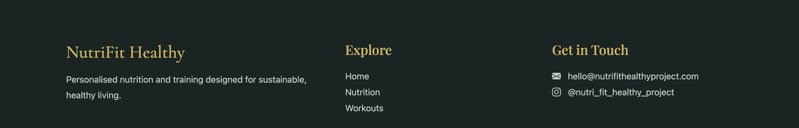

- NutriFit Healthy information.
- Navigation links.
- Contact email.
- Instagram details.
- Copyright information.

### Responsive Design

- Responsive Bootstrap 5 layouts.
- Mobile navigation.
- Responsive cards, forms, tables, and footer.
- Designed for desktop, tablet, and mobile screens.

## Technologies Used

### Languages

- HTML5
- CSS3
- JavaScript
- Python

### Frameworks and Libraries

- Django
- Bootstrap 5
- Django Allauth
- Stripe 
- Gunicorn
- WhiteNoise

### Database

The application uses Django's database system. SQLite is suitable for local development, while the deployed application can use a production PostgreSQL database configured through the environment.

### Media and Static Files

- WebP images are used to improve image performance.
- WhiteNoise serves static files in production.
- Cloudinary is cloud-based image and media storage where required.

### Django Application

The project is divided into several Django applications:

- `home`
- `accounts`
- `nutrition`
- `workouts`
- `cart`
- `payments`

## Home

Manages the main page of the website, including the homepage and general introductory content about NutriFit Healthy.

## Accounts 

Handles user-related functionality, including user registration, login, logout, profile management, and account-related features.

**CustomerProfile:** Stores personal details associated with an authenticated user.

The profile is linked to the Django user account and supports create, read, update, and delete operations.

## Nutrition Plan

Manages the nutrition plans available on the website, including plan information such as descriptions, prices and duration.

## Workout Plan

Manages the workout plans offered by NutriFit Healthy, allowing users to view the available workout options and their details.

## Cart

Handles the shopping cart functionality, allowing users to add plans to their cart, view selected items, update their selections, and remove items before checkout.

## Payment

**Order:**

Stores purchase information.

Fields include:

- User
- Order number
- Full name
- Email
- Date
- Order total
- Stripe Checkout Session ID (`stripe_pid`)

The `user` field links an order to an authenticated account when applicable.

**OrderItem:**

Stores individual products belonging to an order.

Fields include:

- Order
- Nutrition plan
- Workout plan
- Quantity
- Line total

An order item contains either a nutrition plan or a workout plan. The line total is calculated from the selected plan price and quantity.

## Relationship

- One Django User → zero or one CustomerProfile.
- One User → many Orders.
- One Order → many OrderItems.
- One NutritionPlan → many OrderItems.
- One WorkoutPlan → many OrderItems.

### Project Management

GitHub Projects was used to manage development tasks and user stories.

The board used the following stages:

- **To Do**
- **In Progress**
- **Done**

During development, the scope of NutriFit Healthy evolved. Earlier ideas involving meal logging, workout entry editing, and progress tracking were replaced by functionality more appropriate to the final e-commerce application, including the shopping cart, Stripe checkout, customer profiles, and order history.

This reflects an iterative Agile development process in which priorities were reviewed and user stories were updated as the application developed.

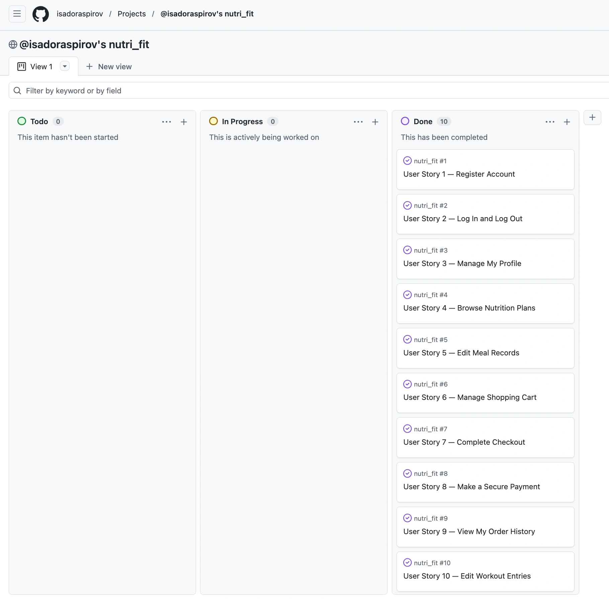

### Tools & Services

## Development Tools

- Git
- GitHub
- VS Code
- Django Admin
- Heroku
- Stripe
- Cloudinary
- PostgreSQL 

## Design Tools

- Canva
- AI image generation tools

## Validation and Testing Tools

- W3C HTML Validator
- W3C CSS Validator
- JSHint
- Chrome DevTools
- Lighthouse
- Django system checks

## Security

NutriFit Healthy uses several Django and deployment security features:

- CSRF protection on POST forms.
- Django authentication and `login_required` protection for account-specific views.
- Environment variables for sensitive configuration.
- Stripe secret key stored outside source code `.env`.
- Django `SECRET_KEY` stored as an environment variable.
- `X_FRAME_OPTIONS = "DENY"` for clickjacking protection.
- Secure cookies in production.
- HTTPS redirection in production.
- HSTS configuration in production.
- Django form validation.
- Server-side validation of cart and checkout information.

Production security settings are enabled when `DEBUG` is disabled.

Sensitive environment variables must never be committed to GitHub.

### Django System Checks

During development the project was checked using:

```bash
python manage.py check
```

Production configuration can additionally be reviewed with:

```bash
python manage.py check --deploy
```

### Manual Testing

The application should be manually tested across its main functionality before final submission.

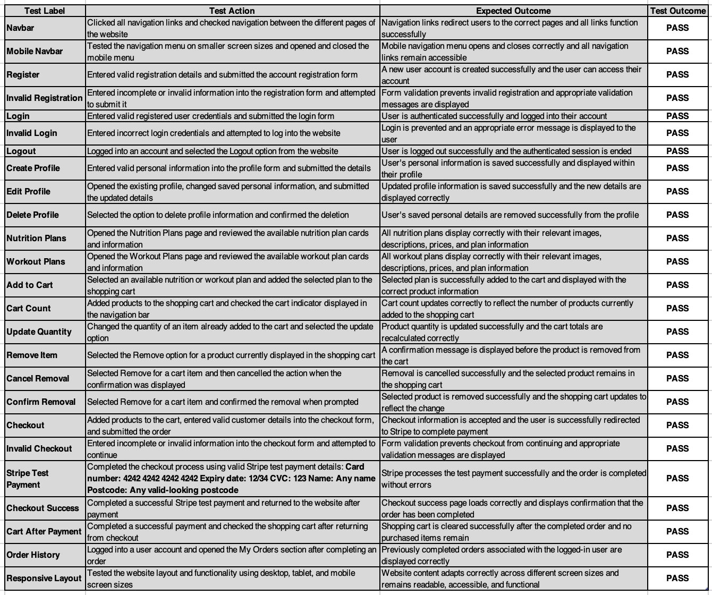

## User Stories Testing

### User Story 1 — Register an Account

- Registration page is accessible.
- Valid account creation works.
- Invalid data displays validation feedback.

### User Story 2 — Log In and Log Out

- Valid credentials allow authentication.
- Invalid credentials display feedback.
- Logout ends the authenticated session.

### User Story 3 — Manage My Profile

- Users can create personal details.
- Saved details are displayed.
- Details can be edited.
- Details can be deleted without deleting order history.

### User Story 4 — Browse Nutrition Plans

- Nutrition plans display correctly.
- Product information is visible.
- Plans can be added to the cart.

### User Story 5 — Browse Workout Plans

- Workout plans display correctly.
- Product information is visible.
- Plans can be added to the cart.

### User Story 6 — Manage Shopping Cart

- Products appear in the cart.
- Quantities update correctly.
- Totals recalculate correctly.
- Removal confirmation works.
- Products can be removed.

### User Story 7 — Complete Checkout

- Checkout form displays.
- Invalid input is rejected.
- Valid details allow checkout to continue.

### User Story 8 — Make a Secure Payment

- Stripe Checkout opens successfully.
- Test payment can be completed.
- Successful payment redirects correctly.
- Cart is cleared after successful payment.

### User Story 9 — View My Order History

- Authenticated users can access their orders.
- Order number, date, products, quantities, and total are displayed.
- Orders are associated with the appropriate user.

### User Story 10 — Responsive and Accessible Navigation

- Main navigation works.
- Account options change based on login state.
- Mobile navigation works.
- Cart is accessible from the navbar.

## Automated Testing with Lighthouse

Google Lighthouse was used to evaluate the deployed application for:

- Performance
- Accessibility
- Best Practices
- SEO

During optimisation, large images were converted/resized to WebP, significantly improving the Performance score.

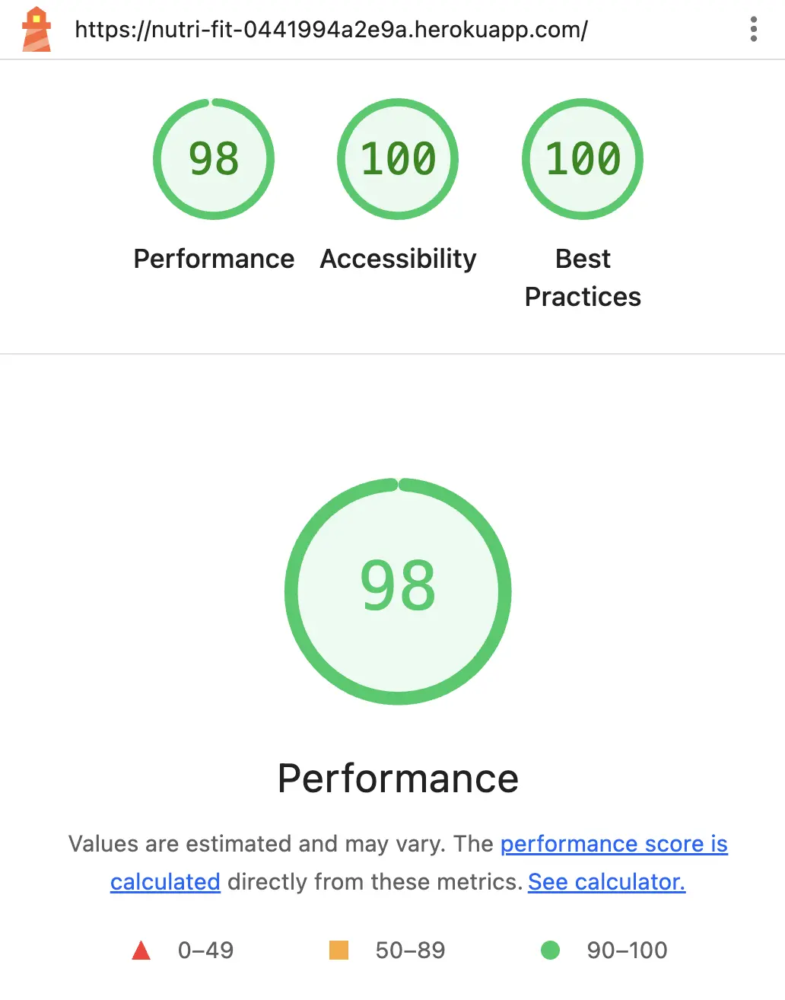

## HTML, CSS and JavaScript Validation

The final application should be checked using:

- W3C HTML Validator
- W3C CSS Validator
- JSHint or an equivalent JavaScript validation tool

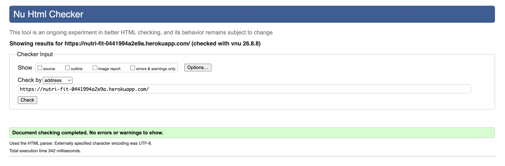

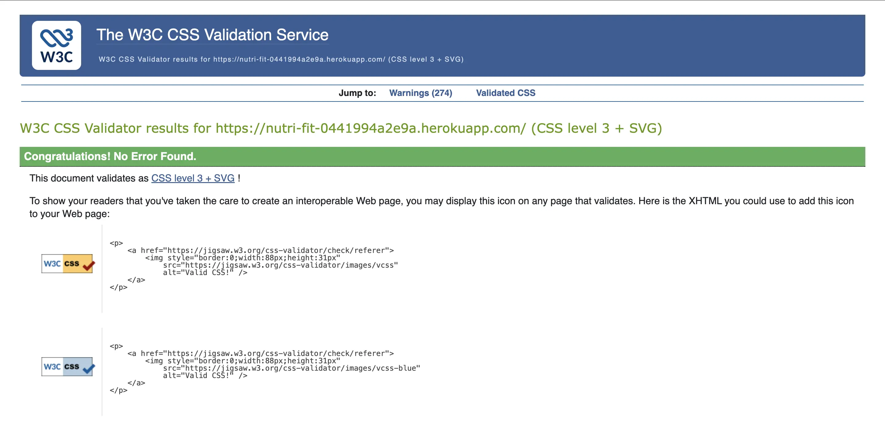


